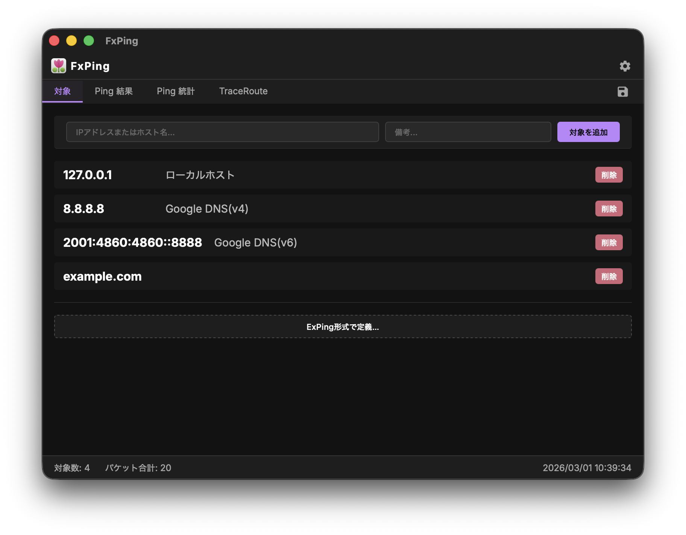
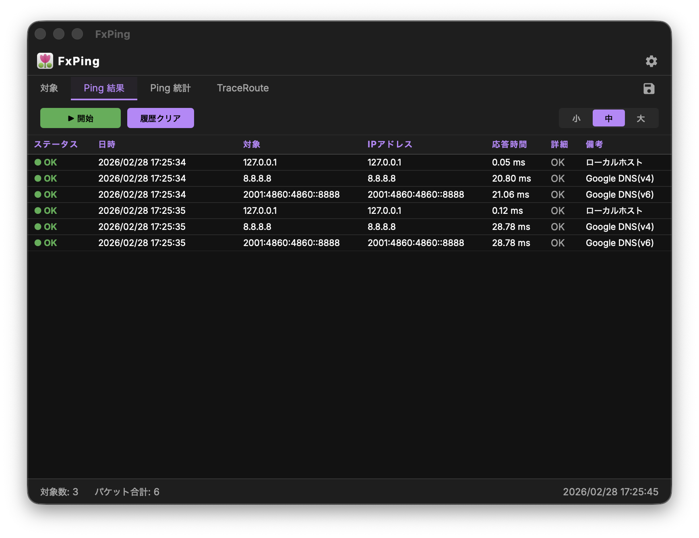
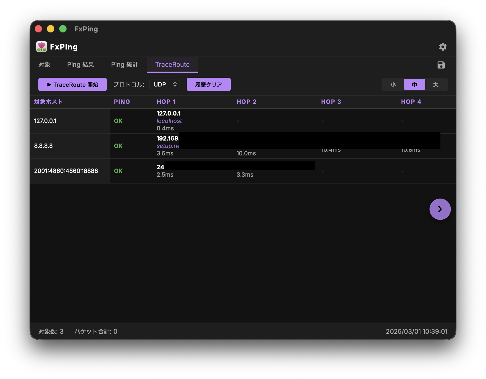
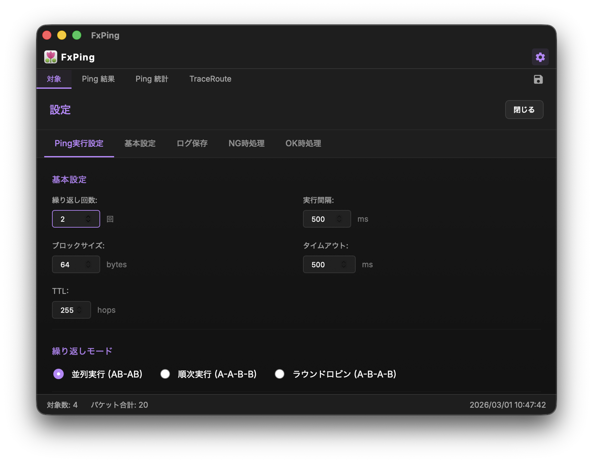
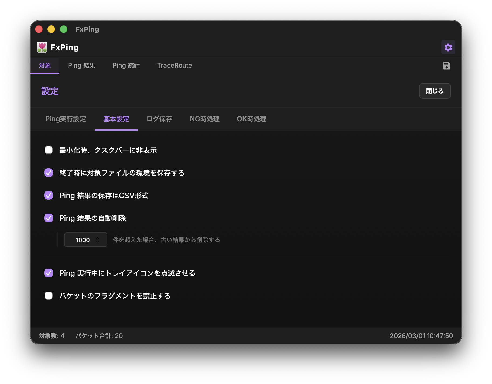
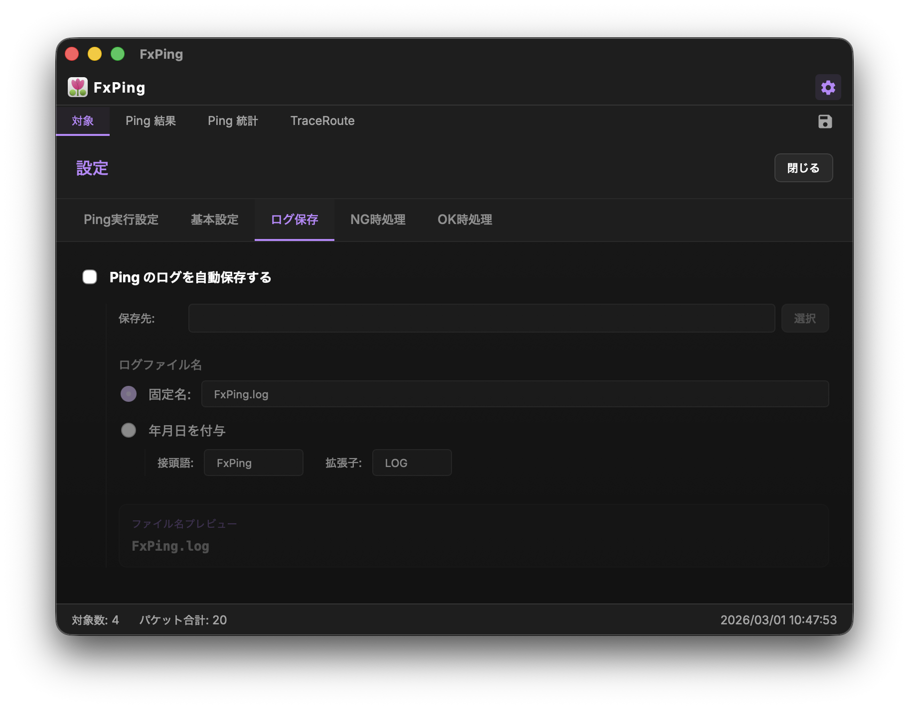
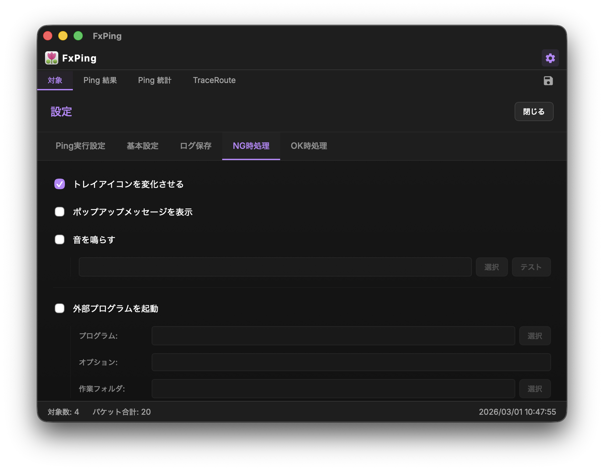
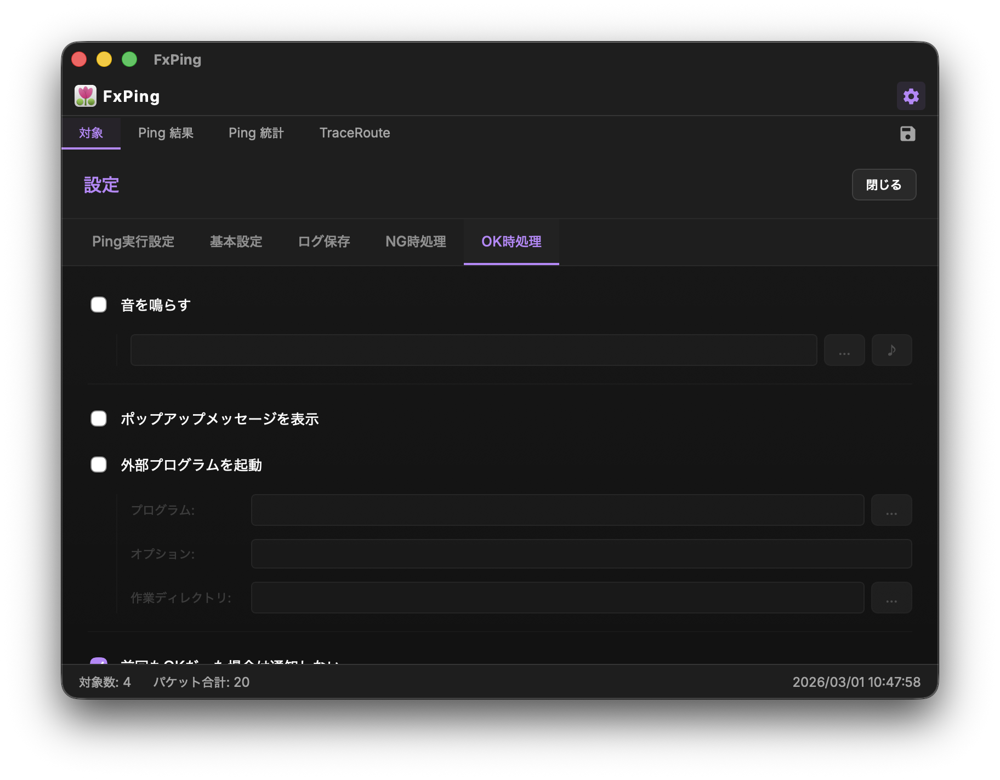

# FxPing 使い方

> **‼️ 重要:** 一部機能は未実装となります。また現在、開発中のため、予期せぬ動作をする可能性があります。

## アプリの概要

FxPing はネットワークの **Ping** と **Traceroute** を簡単に実行できるデスクトップアプリです。  
モダンフレームワークの Tauri と React をベースに構築されており、以下の機能を提供します。

| 機能 | 説明 |
|------|------|
| 複数ホスト同時 Ping | 複数のターゲットに対して同時/順次/ラウンドロビンで Ping を実行 |
| Traceroute | ICMP または UDP プロトコルでルートを追跡 |
| IPv6 対応 | IPv4 / IPv6 どちらも利用可能 |
| 通知機能 | NG / OK 検出時にポップアップ・サウンド・外部プログラム起動で通知 |
| ログ保存 | Ping 結果を自動でファイルに保存 |
| 設定の細かなカスタマイズ | タイムアウト・ペイロードサイズ・TTL・繰り返しモードなど多数 |

---

## 起動方法

macOS : Application フォルダに FxPing.app を移動して起動してください。
> **⚠️ 注意:** macOS 環境では、Application フォルダに移動しないとPingやTraceRouteが実行できない場合があります。  

> **⚠️ 注意:** 本アプリはmacOSのセキュリティ機能により、FxPingが正常に動作しない場合があります(野良アプリなので…)。  
> その場合は、以下の手順でFxPingに実行許可を与えてください。
> 1. 「システム設定」を開く
> 2. 「プライバシーとセキュリティ」を開く
> 3. 「お使いのMacを保護するために"FxPing.app"がブロックされました」の「このまま開く」をクリックする
> 4. 「パスワード」を入力する
> 【参考】 https://qiita.com/portfoliokns3/items/f6d4d15c3f8c54fdac8d

Windows : FxPing.exe をダブルクリックして起動してください。
> **⚠️ 注意:** Windows 環境では、WebView2Loader.dllを同じパスに配置する必要があります。

---

## 対象OS・環境
以下のバージョンのみ動作検証しています。それ以前のバージョンでは動作しない可能性があります。

 * macOS : macOS 26.0以降
 * Windows : Windows 11 25H2 以降

> **留意:** Windows 環境では、[WebView2ランタイム](https://learn.microsoft.com/ja-jp/microsoft-edge/webview2/)のインストールが必要です。なお Windows 11 では標準でインストールされています。

---

## 画面構成

アプリは上部のタブで各機能を切り替えます。

| タブ | 内容 |
|------|------|
| **Targets** | Ping / Traceroute の対象ホストを管理 |
| **Ping** | Ping の実行と結果の確認 |
| **Traceroute** | Traceroute の実行とホップ一覧の確認 |
| **⚙ (設定)** | 各種動作をカスタマイズ |
| **💾 (保存)** | タブに応じた設定やログを保存します |

---

## ターゲットの追加と管理

1. **Targets タブ** を開きます。
2. テキストボックスに `ホスト名`・`IP アドレス`・`ネットワークセグメント` を入力します。
   - IPv4 アドレス (例: `198.51.100.1`)
   - IPv6 アドレス (例: `2001:db8::1`)
   - FQDN (例: `example.com`)
   - ネットワークセグメント (CIDR) (例: `192.168.1.0/24`) 
     - セグメントを入力して追加すると、その **範囲内の全 IP アドレスがリストに展開** されて登録されます。
3. `備考` 欄に、そのホストに関するメモ（例: `ルータ`, `Google DNS` など）を入力できます。
4. `対象を追加` ボタンをクリック（または Enter キー）するとリストに追加されます。

### リストの操作と一括処理

リストの見出し行および各行には、以下の操作機能があります。

| 機能 | 説明 |
|------|------|
| **チェックボックス** | チェックが入っているホストのみが Ping / Traceroute の対象となります。見出し行のチェックボックスで全選択/全解除が可能です。 |
| **反転** | チェックが入っている項目とそうでない項目を、すべて反転させます。 |
| **ステータス一括選択** | Ping 実行後の結果に基づいて、対象を絞り込めます（全部OKのみ / OKが1回以上 / NGが1回以上 / 全部NGのみ）。 |
| **選択ホストを削除** | 現在チェックが入っているホストをリストから一括削除します。 |
| **削除ボタン** | 各行の右側にあるボタンで、個別にホストを削除できます。 |

### ExPing 形式での定義

既存の **ExPing.def** 形式の定義を利用して、一括でターゲットを設定できます。

1. `ExPing形式で定義…` ボタンをクリックすると入力エリアが表示されます。
2. 直接テキストを入力するか、`.def` ファイルをテキストエリアにドラッグ＆ドロップしてください。
   - `ホスト 備考` の形式（スペース区切り）で 1 行ずつ記述します。
   - `'` または `‘` で始まる行はコメントとして扱われます。
3. `適応` ボタンをクリックすると、現在のリストが入力内容で上書きされます。

> **ℹ️ ヒント:** ターゲットの数が多いとネットワーク帯域やシステムリソースに影響することがあります。必要に応じてターゲット数を調整してください。

> **⚠️ 注意:** Ping並列実行の場合、ターゲット数が多いとFxPingが応答しなくなることがあります。その場合は、ターゲット数を減らすか、順次実行またはラウンドロビンに変更してください。

---

## Ping の実行

1. **Ping タブ** を開きます。
2. `開始` ボタンをクリックします。
3. 設定した繰り返し回数・間隔・タイムアウトに従い、設定に基づき全ターゲットへ Ping が実行されます。
4. 結果はテーブルに **OK** (緑) / **NG** (赤) で表示されます。

### 操作ボタン

| ボタン | 動作 |
|--------|------|
| 開始 | Ping を開始します |
| 停止 | 実行中の Ping を中断します |
| 履歴クリア | 結果テーブルをリセットします |

---

## Traceroute の実行

1. **Traceroute タブ** を開きます。
2. プロトコルを選択します。

   | プロトコル | 説明 |
   |-----------|------|
   | **ICMP** | 標準的な Traceroute。管理者権限不要 |
   | **UDP** | UDP を使ったルート追跡。**Windows では管理者権限が必要** |

3. `▶ TraceRoute 開始` ボタンをクリックします。
4. 各ホップの **IP アドレス**・**FQDN**（オプション）・**応答時間** がテーブルに表示されます。
   - `-` は応答なしを示します。
   - ホスト名解決可能な場合、ホスト名も表示されます。
5. テーブルは **横スクロール** 可能で、左右矢印ボタンでホップ数が多い場合も閲覧できます。

> **⚠️ 注意:** Windows 環境で UDP を使用する場合、管理者モードで起動していないと警告が表示されて実行が中止されます。

---

## 設定画面

画面右上の **⚙ アイコン** をクリックして設定モーダルを開きます。設定はタブで切り替えます。

---

### ① Ping 設定

#### 基本設定

> **ℹ️ ヒント:** この画面は元々ExPingの「環境」の設定項目を踏襲しています。

| 項目 | 説明 | 範囲 |
|------|------|------|
| **繰り返し回数** | Ping を何回繰り返すか | 1 〜 99,999 回 |
| **実行間隔** | Ping 間のインターバル | 100 〜 60,000 ms |
| **ブロックサイズ** | ICMP ペイロードサイズ | 0 〜 65,507 bytes |
| **タイムアウト** | 応答を待つ最大時間 | 1 〜 300,000 ms |
| **TTL** | IP パケットの生存時間 | 1 〜 255 hops |

> **ℹ️ ヒント:**
> - 実行間隔は最小 100 ms の制限があります。これは ICMP フラッディング（DoS 攻撃と誤認されるリスク）を防ぐためです。
> - ブロックサイズは IP 最大パケットサイズ (65,535) から 標準的なIPv4 ヘッダ (20 bytes) と ICMP ヘッダ (8 bytes) を差し引いた 65,507 bytes が上限です。
>  - ただし一般的なEthernet環境（MTU 1500）におけるインターネットへのPingは 1472 バイトがフラグメント（分割）されない最大サイズです。
>  - LAN内でジャンボフレーム（MTU 9000）を許可した場合でも、フラグメントなしでの最大は 8972 バイトとなります。
>  - 一般設定 > パケットのフラグメントを禁止する を有効にすると、ブロックサイズは一般的に 1472 バイト以下に制限されます。
>  - ネットワーク機器によっては、ブロックサイズが大きすぎると応答しない場合があります。利用する場合は検証を行ってください。

#### 繰り返しモード

複数ターゲットがある場合の Ping の実行順序を選べます。

| モード | 動作 | 例（ホストA, ホストB の 2 ターゲット） |
|--------|------|--------------------------|
| **並列実行** | 全ターゲットを同時に Ping | A と B を同時実行。 本モードはFxPingに追加実装された機能です。 |
| **順次実行** | ターゲットごとに繰り返し回数分実行してから次へ | A→A→A…→B→B→B… |
| **ラウンドロビン** | 1 回ずつ交互に実行 | A→B→A→B… |

#### 定期実行

`定期的に実行する` を有効にすると、指定した待機時間（秒）の後に Ping を再開します。繰り返し回数が終わった後も自動で Ping が続きます。

---

#### TraceRoute オプション

| 項目 | 説明 |
|------|------|
| **最大 HOPS** | Traceroute の最大ホップ数（1 〜 255） |
| **ホスト名の解決を行う** | Traceroute 結果に FQDN を表示するかどうか |

---

### ② 一般設定

| 項目 | 説明 |
|------|------|
| **最小化時、タスクバーに非表示** | ウィンドウを最小化するとタスクバーから消え、トレイアイコンのみになります |
| **終了時に対象ファイルの環境を保存する** | アプリ終了時に現在のターゲット設定を保存し、次回起動時に復元します |
| **Ping 結果の保存は CSV 形式** | ログファイルをテキスト形式ではなく CSV 形式で出力します |
| **Ping 結果の自動削除** | 結果が指定件数を超えた場合、古いものから自動削除します |
| **Ping 実行中にトレイアイコンを点滅させる** | 実行中であることをトレイアイコンの点滅で示します |
| **パケットのフラグメントを禁止する** | ICMP パケットの分割送信を禁止します（DF ビットを立てます） |

---

### ③ ログ設定

Ping の結果をファイルに自動保存する設定です。

| 項目 | 説明 |
|------|------|
| **Ping のログを自動保存する** | 有効にするとログが指定フォルダへ自動的に保存されます |
| **保存先** | ログファイルを保存するフォルダパスを指定します（`選択` で参照） |

#### ログファイル名の形式

| 形式 | 説明 | 例 |
|------|------|-----|
| **固定名** | 常に同じファイル名で上書き保存 | `ping_result.log` |
| **年月日を付与** | 接頭語 + 日付 + 拡張子のファイル名で日別保存 | `ping260301.LOG` |

`ファイル名プレビュー` で現在のファイル名を確認できます。

---

### ④ NG 通知設定

Ping が **NG**（失敗・タイムアウト）になったときのアクションを設定します。

#### アクション

| 項目 | 説明 |
|------|------|
| **トレイアイコンを変化させる** | NG 検出時にシステムトレイのアイコンを変更して視覚的に通知します |
| **ポップアップメッセージを表示** | NG を検出するとポップアップ通知を表示します |
| **音を鳴らす** | 指定したサウンドファイルを再生します。`選択` ボタンでファイルを選び、`テスト` で試し再生できます |
| **外部プログラムを起動** | 指定したプログラムを実行します。`プログラム`・`オプション`・`作業フォルダ` を個別に設定できます |

#### 通知タイミングのフィルタリング

| 項目 | 説明 |
|------|------|
| **レスポンス遅延時に NG 処理を実行** | 指定 ms 以上の遅延が発生した場合も NG として扱います |
| **一度通知したアドレスは 2 回目以降通知しない** | 同じホストへの重複通知を防ぎます |
| **前回も NG だった場合は通知しない** | 連続 NG が続く場合、2 回目以降の通知を抑制します（「一度通知したら…」がオフのときのみ有効） |
| **NG が特定回数に達するまで通知しない** | 指定した回数 NG になるまで通知を保留します。`連続した NG のみカウント` を有効にすると、連続失敗時のみカウントします |
| **「通知しない」設定は定期実行ごとに有効** | 通知抑制フィルターが定期実行の 1 サイクルごとにリセットされます |

---

### ⑤ OK 通知設定

Ping が **OK**（成功）になったときのアクションを設定します。

#### アクション

| 項目 | 説明 |
|------|------|
| **音を鳴らす** | OK 検出時に指定したサウンドを再生します |
| **ポップアップメッセージを表示** | OK を検出するとポップアップを表示します |
| **外部プログラムを起動** | 指定したプログラムを実行します。プログラム・オプション・作業ディレクトリを設定します |

#### 通知タイミングのフィルタリング

| 項目 | 説明 |
|------|------|
| **前回も OK だった場合は通知しない** | 連続して OK が続く場合は通知を抑制します |
| **「通知しない」設定は定期実行ごとに有効** | 通知抑制フィルターが定期実行の 1 サイクルごとにリセットされます |

---

## 結果のクリア

- **Ping タブ**・**Traceroute タブ** それぞれに `履歴クリア` ボタンがあります。
- クリアしてもターゲットリストは変わりません。

---

## ⚠️ 注意事項

- UDP Traceroute は **Windows 環境で管理者権限が必要** です。権限がない場合は警告が表示されて実行が中止されます。
- 大量のターゲットを同時実行するとネットワーク帯域やシステムリソースに影響が出る可能性があります。必要に応じてターゲット数や実行間隔を調整してください。
- ICMP Ping を高頻度で実行すると、ファイアウォールや IDS、ルータ で DoS 攻撃と誤認される場合があります。実行間隔（最小 100 ms）を適切に設定してください。

---

## よくある質問 (FAQ)

### Q1. 「NG」は何を意味しますか？
Ping がタイムアウトした、または応答が返ってこなかった場合に `NG` と表示されます。ホスト名が解決できなかった場合も `NG` になります。

Traceroute の場合は、そのホップが応答しなかった場合 `-` と表示されます。

> **ℹ️ ヒント:** Traceroute で `-` が表示されるのは、そのホップが応答しなかったことを示します。これは、ファイアウォールやルータが ICMP パケット や UDPの Time exceeded / Destination unreachable をブロックしている場合や、そのホップが応答しない設定になっている場合に発生します。よって、お使いの環境以外の問題である可能性も高いです。

### Q2. テーブルが横に長くなりすぎた場合は？
左右の矢印ボタンでスクロールできます。また、テーブルサイズ（小・中・大）を変更して表示幅を調整できます。

### Q3. 定期実行と繰り返し回数の関係は？
「繰り返し回数」分の Ping が完了したあと、`定期的に実行する` が有効な場合は指定した待機秒数が経過すると再度 Ping が開始されます。
並列実行モードの場合、全ターゲットの Ping が完了した後に待機時間がカウントされます。
これにより継続的な監視が可能になります。

### Q4. 音が鳴らない場合は？
- サウンドファイルが正しく指定されているか確認してください（`テスト` ボタンで試し再生できます）。
- OS の音量設定やミュート状態を確認してください。

### Q5. 外部プログラムを起動設定しても実行されない場合は？
- プログラムのパスが正しいか確認してください。
- 作業フォルダが存在するか確認してください。
- OS のセキュリティ設定によりブロックされている可能性があります。

### Q6. 「前回も NG / OK だった場合は通知しない」と「一度通知したら通知しない」の違いは？
| 設定 | 動作 |
|------|------|
| **一度通知したら通知しない** | あるホストで一度でも通知されると、以後ずっと通知されません |
| **前回も NG だった場合は通知しない** | 直前の結果が NG だった場合のみ通知しません（NG→OK→NG のように変化した場合は通知されます） |

### Q7. 設定が反映されない場合は？
設定はリアルタイムに保存されます。それでも反映されない場合はアプリを再起動してみてください。

### Q8. ホスト名がうまく追加できない場合は？
IPv4/IPv6 アドレス、FQDN（例: `example.com`）、または CIDR 形式（例: `192.168.0.0/24`）のみ受け付けます。スペースや特殊文字が含まれていないか確認してください（CIDR はサブネットマスク部分まで正しく入力してください）。

なお、hosts に登録した簡易な名前（例: `gateway`）は、そのまま追加可能です。

### Q9. FQDN を登録した場合、IPv4 と IPv6 のどちらのアドレスで Ping / Traceroute されますか？

FxPing は FQDN の名前解決を OS の DNS リゾルバに委ねており、**リゾルバが最初に返したアドレス**（A レコードまたは AAAA レコード）をそのまま使用します。

| 条件 | 使用されるアドレス |
|------|------------------|
| DNS が A レコード（IPv4）を先に返した場合 | IPv4 アドレスで実行 |
| DNS が AAAA レコード（IPv6）を先に返した場合 | IPv6 アドレスで実行 |

どちらのレコードが優先されるかは **OS の設定**（macOS: `/etc/hosts` やシステム設定、Windows: ネットワークアダプタの設定など）によって決まるほか、RFC 6724 に基づくアドレス選択アルゴリズムの影響も受けます。一般的には次の傾向があります。

- **デフォルトの macOS / Windows 環境**: IPv6 アドレスが存在する場合は IPv6 が優先されることが多い（RFC 6724 に基づくアドレス選択）
- **IPv4 のみの環境**: IPv4 アドレス（A レコード）が使用される

> **ℹ️ ヒント:** 使用するアドレスを明示的に指定したい場合は、FQDN ではなく **IP アドレスを直接入力**してください（例: `198.51.100.1` または `2001:db8::1`）。

### Q10. ホストは動作しており、ネットワークも正しいのに Pingが 応答しません。

ターゲットホストやネットワーク経路上のデバイス（ファイアウォール、ルーターなど）が **ICMP Echo Request（Ping）をブロック**している可能性があります。

- **ホスト側の設定**: サーバやクライアントに対してPingを送信する場合は、Windows ファイアウォールや Linux の `iptables` / `ufw` などで、ICMP パケットの受信が許可されているか確認してください。
- **クラウド・ネットワーク機器**: AWS のセキュリティグループ、ルーターやFW の ACL（アクセス制御リスト）や セキュリティポリシー などで ICMP が明示的に拒否されていないか確認してください。
- **Ping応答ポリシー**: セキュリティ対策として、外部からの Ping 応答を意図的に無効化しているサーバーも多く存在します。この場合、ホストが正常に稼働していても Ping はタイムアウトになります。

> **⚠️ 注意:** 特に **空きIPアドレスの調査を行う際** は、 **Ping 応答がないからといって必ずしもその IP アドレスが未使用であるとは限りません。** 対象が ICMP をブロックしている可能性があるため、同一セグメント内であれば、**実通信(Pingなどを実行)した後** に **ARP テーブル(arp -a)** などでネットワーク上の機器の有無を確認することをお勧めします。

---

## 🚨 FxPing を利用するにあたっての法令規定の遵守について(お願い) 👮🏻

管理権限のない第三者のサーバーやネットワークに対し、許可なく過度な負荷をかける行為（短時間の連続したPing送信、大容量パケットの送信、Tracerouteの実行など）は、サイバー攻撃（DoS攻撃など）とみなされる恐れがあります。  

これらは **[不正アクセス禁止法](https://www.soumu.go.jp/main_sosiki/cybersecurity/kokumin/basic/legal/09/#:~:text=不正アクセス行為の禁止等に関する法律（不正アクセス,パスワード等のことです%E3%80%82)** や、 **[電子計算機損壊等業務妨害罪](https://laws.e-gov.go.jp/law/140AC0000000045#Mp-Pa_1-Ch_2)** などの法令に抵触する可能性があるため、 **絶対に行わない** でください。

本ツールは、ご自身で管理するネットワーク、または事前に許可を得た対象に対してのみご利用ください。  
**職場や学校などのネットワークで利用する場合でも、『必ず事前にネットワーク管理者』 に許可を得てお使いください。**

---

## ユーザーサポート・コミュニティ

### ライセンスについて

FxPing は **[MIT ライセンス](../LICENSE)** のオープンソースソフトウェアです。  

ソースコードの閲覧・改変・再配布は自由に行えます。教育目的や商用目的での利用も可能です。  
ぜひ自分のニーズに合わせてカスタマイズしてみてください。

### 開発へのご協力のお願い

FxPing は個人が手弁当で開発・メンテナンスしているプロジェクトです。  
もし役に立てていただけたなら、以下のような形でぜひ協力をお願いします。

| 協力内容 | 具体的な行動 |
|----------|-------------|
| 🐛 **バグ報告** | 再現手順・環境情報を添えて Issue を立ててください |
| 🔧 **コード貢献** | Pull Request でコードを送ってくれると大変助かります |
| ⭐ **Star** | GitHub でスターを付けてもらえると励みになります |

### Issue・Pull Request の送り先

バグ報告・機能要望・パッチの提出はすべて以下の GitHub リポジトリへお願いします。

👉 **[https://github.com/kamera25/FxPing/tree/main](https://github.com/kamera25/FxPing/tree/main)**

Issue を作成する際は、以下の情報を記載していただけると助かります。

- OS とバージョン（例: macOS 15.3 / Windows 11）
- アプリのバージョン
- 再現手順と期待する動作・実際の動作

---

### ExPing へのお礼

FxPing は、Windows 向けのネットワークユーティリティ **[ExPing](http://www.woodybells.com/exping.html)** から多大なインスピレーションを受けています。  

ExPing はシンプルかつ高機能な Ping / Traceroute ツールとして長年にわたり多くのネットワーク管理者に愛用されてきた、まさに名作ソフトウェアです。  

そのわかりやすい UI 設計・豊富な通知機能・細やかな設定項目は、FxPing の設計思想の原点となっています。

ExPing の作者および関係者の皆様に、心からの感謝と敬意を表します。